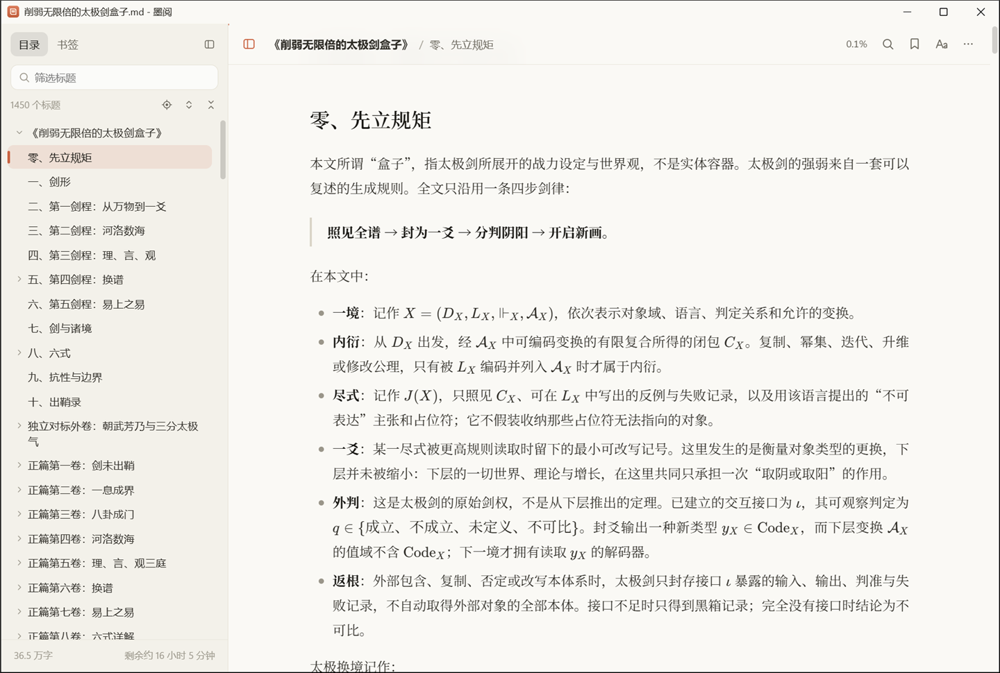

# 墨阅语法示例

这一段包含 **粗体**、*斜体*、~~删除线~~、==高亮==、`行内代码`、[外部链接](https://example.com)、自动链接 https://example.org/path?q=1 以及 emoji 😀。中英文混排 Markdown 阅读器 v1.0 的效果。

行内公式：$E = mc^2$，以及 \(\alpha + \beta = \gamma\)。普通美元符号不应被识别为公式：价格 $5 和 $10，还有 3$ 这种写法。

## 公式

$$
\int_0^\infty e^{-x^2}\,dx = \frac{\sqrt{\pi}}{2}
$$

\[
\begin{aligned}
f(x) &= \sum_{n=0}^{\infty} \frac{f^{(n)}(a)}{n!}(x-a)^n \\
     &= f(a) + f'(a)(x-a) + \cdots
\end{aligned}
\]

```math
\mathbf{A} = \begin{pmatrix} 1 & 2 \\ 3 & 4 \end{pmatrix}
```

段落中间的显示公式 $$\sum_{i=1}^{n} i = \frac{n(n+1)}{2}$$ 会单独成行。

一个错误的公式应当优雅降级：$\frac{1}{$ 后面的文字仍然正常。

## 表格

| 左对齐 | 居中 | 右对齐 |
|:---|:---:|---:|
| 苹果 | \(x^2\) | 1.00 |
| 香蕉 | 含竖线 \| 的单元格 | 22.50 |
| 一段比较长的文字，用来测试单元格内的自动换行效果是否正常 | **粗体** | 333 |

## 列表

- 第一项
- 第二项
  - 嵌套 A
  - 嵌套 B
    1. 更深一层
    2. 继续
- 第三项

3. 从三开始
4. 第四

- [x] 已完成的任务
- [ ] 未完成的任务

## 引用与提示

> 第一层引用
>
> > 第二层引用

> [!NOTE]
> 这是一个注意提示块。

> [!WARNING] 自定义标题
> 这是一个警告提示块，带有自定义标题。

## 代码

```js
// 计算斐波那契数列
function fib(n) {
  return n < 2 ? n : fib(n - 1) + fib(n - 2);
}
console.log(fib(10));
```

```python
def greet(name: str) -> str:
    return f"你好，{name}"
```

    缩进代码块
    第二行

## 脚注与其它

这里有一个脚注[^1]，还有另一个[^note]。

[^1]: 第一个脚注的内容。
[^note]: 第二个脚注，可以包含 **格式**。

<details>
<summary>点击展开</summary>

折叠区域中的 **Markdown** 内容。

</details>

按下 <kbd>Ctrl</kbd> + <kbd>F</kbd> 查找；H<sub>2</sub>O 与 x<sup>2</sup>。


<script>alert('不应执行')</script>
<style>body { display: none !important; }</style>



---

[跳到表格](#表格) · [跳到不存在的锚点](#不存在)

超长链接测试：https://example.com/very/long/path/that/should/wrap/properly/without/breaking/the/layout/of/the/page/at/all/0123456789
